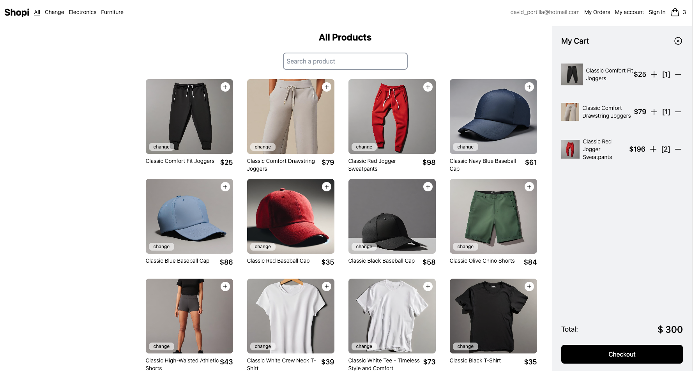

  <h1> Shopi Store </h1>
    
  
   
   
  
 Final result 

    
<strong><a href="https://shopi-store.vercel.app/" target="_blank" rel="noopener noreferrer">https://shopi-store.vercel.app/</a></strong>

   

# Shopi

Shopi is an e-commerce application developed with modern technologies to provide a fast and efficient user experience. This project uses a combination of frontend tools to create an attractive and functional interface.

## Project Description

Shopi allows users to browse a variety of products, add them to their shopping cart, and place orders easily. The application is designed to be scalable and easy to maintain, using best practices in web development.

For the backend, we are using the [Platzi Fake Store API](https://fakeapi.platzi.com/), which provides all the products with their respective images and descriptions.

## Key Technologies and Libraries

- **React**: A JavaScript library for building user interfaces.
- **TypeScript**: A superset of JavaScript that adds static types.
- **Vite.js**: A fast and modern development environment for web applications.
- **TailwindCSS**: A CSS framework for creating custom designs efficiently.
- **React Router**: A library for handling navigation in React applications.
- **uuid**: A tool for generating universally unique identifiers.
- **Context API**: A React mechanism for managing global application state.
